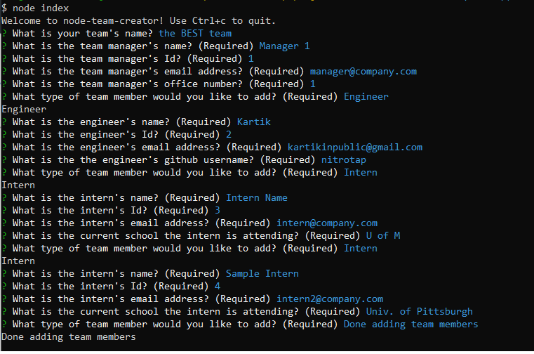
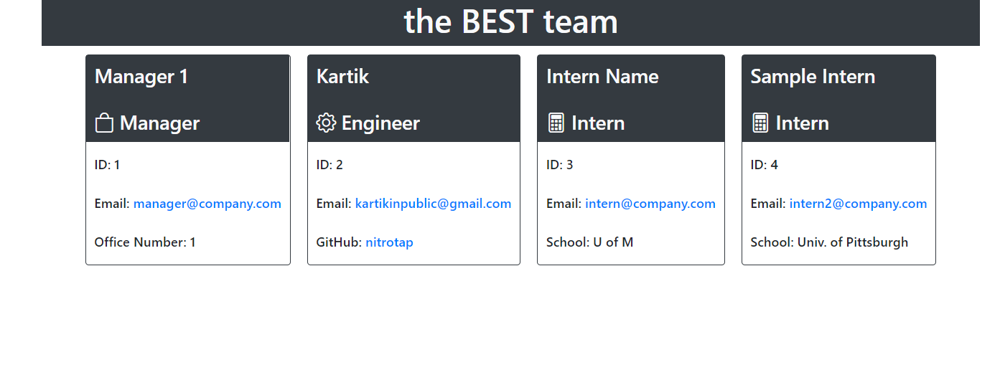

# node-team-creator

## Description

A command-line profile generator using node.js to automatically create personalized bio cards on a simple HTML page.

[](https://opensource.org/licenses/MIT)


## Table of Contents

- [Installation](#Installation)
- [Usage](#Usage)
- [Tests](#Tests)
- [Walk-through Video](#Walk-through)
- [Screen Shots](#screen-shots)
- [Questions](#Questions)
- [License](#License)

## Installation

```
npm i
```

## Usage Information

```
node index.js
```

## Tests

```
npm run test
```

## Walk-through

[Walk-through Video](https://drive.google.com/file/d/1kHCAbyq3VGNSvTyUSZMlJYFkFYlo4OmA/view)

## Screen Shots





## Questions

Please reach out to me on [GitHub](https://github.com/nitrotap) or by email at kartikinpublic@gmail.com for any additional questions.

## License

MIT

Copyright 2022 Kartik Jevaji
Permission is hereby granted, free of charge, to any person obtaining a copy of this software and associated documentation files (the "Software"), to deal in the Software without restriction, including without limitation the rights to use, copy, modify, merge, publish, distribute, sublicense, and/or sell copies of the Software, and to permit persons to whom the Software is furnished to do so, subject to the following conditions:

The above copyright notice and this permission notice shall be included in all copies or substantial portions of the Software.

THE SOFTWARE IS PROVIDED "AS IS", WITHOUT WARRANTY OF ANY KIND, EXPRESS OR IMPLIED, INCLUDING BUT NOT LIMITED TO THE WARRANTIES OF MERCHANTABILITY, FITNESS FOR A PARTICULAR PURPOSE AND NONINFRINGEMENT. IN NO EVENT SHALL THE AUTHORS OR COPYRIGHT HOLDERS BE LIABLE FOR ANY CLAIM, DAMAGES OR OTHER LIABILITY, WHETHER IN AN ACTION OF CONTRACT, TORT OR OTHERWISE, ARISING FROM, OUT OF OR IN CONNECTION WITH THE SOFTWARE OR THE USE OR OTHER DEALINGS IN THE SOFTWARE.
